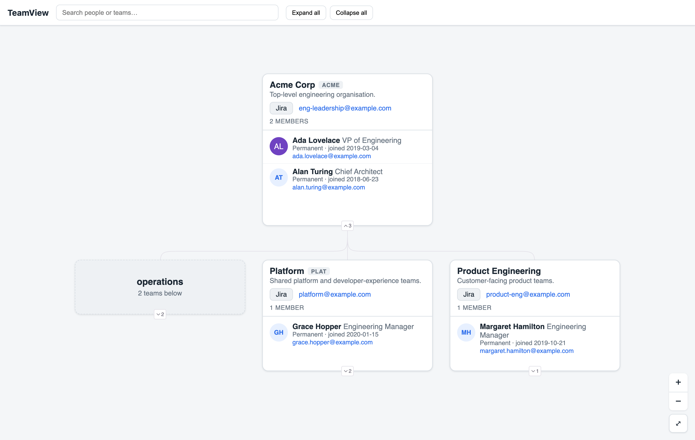

# TeamView

A static website that renders your organisation's structure as a collapsible,
top-down **org chart** from simple `team.yaml` files, with **search** for people
and teams. Drop your teams into a folder tree, push, and it deploys to **GitLab
Pages** or **GitHub Pages** as plain static files — no backend required.



## Features

- **Folder tree = org structure** — nesting maps to reporting lines, to any depth.
- **Optional `team.yaml` at every level** — a folder with one is a team; a folder
  without one is a labelled group.
- **Inline member lists** — role, contract, join date, email, and an optional
  avatar (with an initials fallback).
- **Team acronyms** — shown as a badge and searchable (e.g. find `INFRA`).
- **Fuzzy search** across people and teams that jumps to and highlights a match.
- **Zoom, pan, and expand/collapse** of any branch.
- **Fully static** — a build step compiles the YAML into one JSON file; there's no
  server to run.

## How it works

```
┌──────────────────────────────────────────────────────────┐
│  org/**/team.yaml  ──(build:org)──►  static/org.json       │
│                                          │                 │
│                                          ▼                 │
│                         Vite build  ──►  public/  ──► Pages │
└──────────────────────────────────────────────────────────┘
```

## How the content works

The source of truth is the `org/` folder tree. Nesting represents reporting
structure and can go **any number of levels deep**:

```
org/
└── acme-corp/                  # has team.yaml  → a "team" node
    ├── team.yaml
    ├── platform/               # has team.yaml  → a "team" node
    │   ├── team.yaml
    │   ├── infra/team.yaml
    │   └── data/team.yaml
    ├── product/
    │   ├── team.yaml
    │   └── growth/team.yaml
    └── operations/             # NO team.yaml   → a "group" node (label = folder name)
        ├── finance/team.yaml
        └── people/team.yaml
```

- A folder **with** a `team.yaml` becomes a **team** node showing its info and an
  inline member list.
- A folder **without** a `team.yaml` becomes a **group** node, labelled by the
  folder name and showing how many teams sit beneath it. `team.yaml` is optional at
  every level.

### `team.yaml` format

```yaml
info:
  name: Team A # required
  acronym: TMA # optional — shown as a badge and is searchable
  description: A team
  jira: https://jira.example.com/projects/ABC
  email: team-a@example.com
members:
  - name: Jane Doe # required per member
    email: jane.doe@example.com
    role: Software Engineer
    contract: Permanent
    joindate: 2026-01-01
    photo: https://gitlab.example.com/uploads/-/system/user/avatar/123/avatar.png # optional
```

`photo` is an optional URL — a GitLab profile avatar, Gravatar, or any reachable
image. It renders as a circular avatar; members without one (or with a broken URL)
fall back to their initials.

`info.name` and each member's `name` are required — the build **fails** if they are
missing. Malformed YAML, bad emails or unparseable join dates are reported (emails
and dates as warnings, structural problems as errors).

## Adding or editing a team

1. Create the folder path under `org/` and add a `team.yaml` (copy the format above).
2. Run `npm run build:org` to regenerate `static/org.json`.
3. Commit and push — GitLab CI rebuilds and redeploys.

## Local development

```bash
npm install
npm run dev      # builds org.json, then starts Vite at http://localhost:5173
```

> **Note:** editing a `team.yaml` while `npm run dev` is running does **not**
> hot-reload (the YAML files are outside Vite's module graph). Re-run
> `npm run build:org` to regenerate `static/org.json`; the page then reloads.

Other scripts:

| Command             | What it does                                                  |
| ------------------- | ------------------------------------------------------------- |
| `npm run build:org` | Walk `org/`, validate, write `static/org.json`.               |
| `npm run build`     | `build:org` + `vite build` → finished site in `public/`.      |
| `npm run preview`   | Serve the built `public/` locally (closest to the live site). |

## Deploying to GitLab Pages

Pushing to the default branch runs `.gitlab-ci.yml`, which builds into `public/`
and publishes it to Pages. No extra configuration is needed for the build.

### Making the site private to the organisation (GitLab.com)

By default Pages sites are public. To restrict the site to logged-in org members
only (no anonymous access) — this is **project/group settings, not CI**:

1. Host the project under your **org's top-level GitLab group** and set the
   **project visibility to Private**.
2. Enable **Pages Access Control**: _Settings → General → Visibility, project
   features, permissions_ → toggle **Pages** on and set the access dropdown to
   **"Only project members"**. Visiting the site then requires a GitLab login.
3. Give the whole org access via **group membership**: members of the top-level
   group inherit access, so anyone in the org with at least the **Guest** role can
   view the site.
4. _(Optional, GitLab 17.9+)_ At the group level, enable
   _"Restrict access to only project members on all group projects"_ to apply this
   by default.

> GitLab.com has no "Internal" visibility (that exists only on self-managed
> instances), so group membership is the lever. Granting Guest to many users may
> have seat/licensing implications depending on your tier — check with your GitLab
> admin.

## Tech

- **Vite** — dev server and static build
- **[d3-org-chart](https://github.com/bumbeishvili/org-chart)** — top-down
  collapsible chart with custom HTML nodes (pinned to 3.1.1)
- **Fuse.js** — client-side fuzzy search
- **js-yaml** — YAML parsing in the build script

## License

[MIT](LICENSE) — free to use, fork, and adapt for your own organisation.
